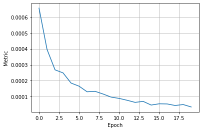
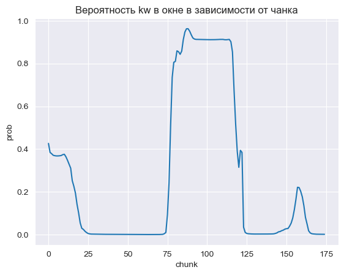

# dla-hw2-kws

Ожидаемый балл: 3 (streaming) +  2.7198 / 10 * 3.5 (compression) = 3.95

Обучение базовой модели велось на Google Colab  

Для реализации стриминга был написан отдельный класс, наследующий nn.Module, и полностью конвертируемый в torch.jit формат (в ноутбуке конвертация приводится из базовой модели, обученной в колабе - она лежит в корне репо "base.pth")  
Помимо прогона stream.py также взял тройку сэмплов, где первый и третий не содержат keyword, а второй содержит; получил ожидаемую повышенную вероятность в центральной части:  

Для сжатия по памяти сделал квантизацию, compression rate составил ~2.7198 (см в ноутбуке)

К сожалению, больше ничего не успел :(  
Задание интересное, но, увы, удалось найти всего несколько часов
